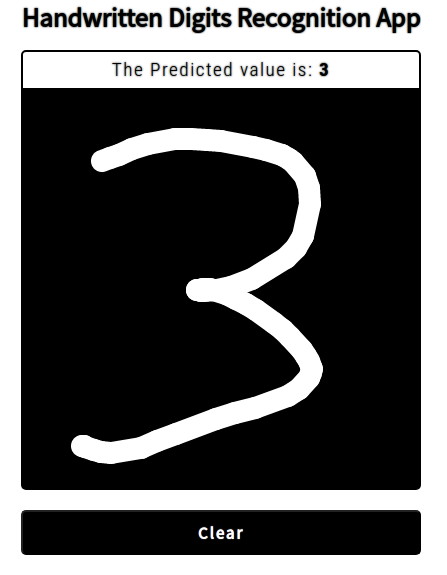

# DigitRecognitionWebApp

This is an implementation of a **digit recognition** web app using Tensorflowjs  «[**Click here to go to the site!**](https://anaximeno.github.io/DigitRecognitionWebApp/ "Digit Recognition Web App")»

*If you want to learn TensorflowJS I recommend the book:*  
 > [Practical TensorFlow.js Deep Learning in Web App Development by Juan De Dios Santos Rivera](https://www.amazon.com.br/Practical-TensorFlow-js-Learning-Development-English-ebook/dp/B08JLKDX2D)
